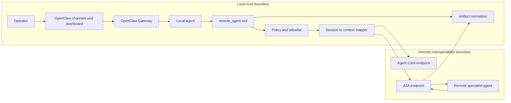

# openclaw-a2a-secure-runtime

A reference architecture and proof of concept for secure agent-to-agent interoperability with OpenClaw.

## Executive Summary

This repository explores a conservative interoperability model between OpenClaw and A2A-compatible remote agents.

The central design choice is to keep OpenClaw as the **local control plane** for operator trust, session continuity, tool execution, and channel integration, while introducing A2A as a **constrained delegation layer** for specialist remote tasks.

Instead of exposing a personal OpenClaw gateway directly as a public agent endpoint on day one, this design starts with **outbound delegation only**. That choice reduces exposure, preserves the documented OpenClaw trust boundary, and gives us a smaller surface area for policy enforcement, auditing, and incremental rollout.

The implementation focuses on four core concerns:

1. **Discovery** through remote Agent Cards
2. **Delegation** through a local `remote_agent` bridge tool
3. **Lifecycle management** by mapping local session state to remote A2A task state
4. **Normalization** by converting remote artifacts into local replies that are safe and usable inside OpenClaw

This repository is **not** a full A2A implementation and **not** a production-ready OpenClaw plugin. It is a reference point for engineers who want to reason about secure agent interoperability in production-oriented systems.

---

## Why This Repository Exists

Most agent demos prove that one agent can call another.

That is not the hard problem.

The harder problem is building a runtime that preserves:

- operator trust boundaries
- session continuity
- clear task ownership
- policy enforcement
- safe artifact handling
- incremental rollout without turning a personal assistant into a public multi-tenant service

OpenClaw already provides a strong local control plane: channels, sessions, tools, plugins, sub-agents, ACP bridging, and a browser dashboard. A2A adds a strong interoperability model: agent discovery through Agent Cards, skill-based delegation, tasks, artifacts, and remote execution lifecycle semantics.

This repository exists to connect those two worlds without pretending they are the same thing.

The thesis is simple:

> Keep OpenClaw local. Use A2A remotely. Bridge them conservatively.

---

## Problem Statement

A personal OpenClaw deployment is optimized for one trusted operator boundary per gateway.

A2A is optimized for communication between independent agent systems.

If you combine them naively, several problems appear immediately:

- local sessions do not automatically map to remote A2A contexts
- local runs do not automatically map to remote A2A tasks
- remote artifacts may not be safe to surface directly
- remote delegation can widen the trust boundary too quickly
- exposing the local gateway publicly can violate the intended OpenClaw security posture

So the real problem is not “can OpenClaw talk to another agent?”

The real problem is:

> How do we introduce agent-to-agent interoperability while preserving OpenClaw as the system of record for the local operator, the local session, and the local trust boundary?

---

## Design Goals

This project aims to:

1. **Preserve OpenClaw as the local control plane**
   - Local channels, sessions, and operator context remain anchored in OpenClaw.

2. **Introduce remote delegation safely**
   - Remote A2A agents are treated as specialist execution targets, not as replacement control planes.

3. **Keep the first deployment model private**
   - The initial architecture is outbound-only.

4. **Maintain session continuity across systems**
   - Each local session can map to a stable remote `contextId`.

5. **Make remote work traceable**
   - Each delegated run maps to a specific remote `taskId`.

6. **Normalize outputs before surfacing them locally**
   - Local consumers receive a clean reply rather than raw remote protocol output.

7. **Create a path to a fuller interoperability layer later**
   - The bridge is designed to evolve without forcing public exposure up front.

---

## Non-Goals

This repository does **not** aim to provide:

- full A2A specification coverage
- production authentication or authorization flows
- public multi-tenant hosting
- billing, quotas, or enterprise policy enforcement
- full streaming and push notification support
- complete file or binary artifact handling
- compatibility guarantees with a specific future OpenClaw plugin API

This is a design-and-implementation reference, not a finished product.

---

## Architecture Overview



### Architectural Thesis

- **OpenClaw owns the user-facing session**
- **A2A owns remote specialist task execution**
- **The bridge owns translation, policy, and lifecycle management**

---

## Core Design Decisions

### 1. Outbound-only first

The first version delegates from OpenClaw to remote A2A agents but does not expose the personal gateway as a public A2A endpoint.

Why:

- lower exposure risk
- simpler trust model
- better alignment with OpenClaw’s documented personal-assistant posture
- easier rollback if delegation policies are wrong

### 2. OpenClaw remains the system of record

Local channels, operator actions, and session continuity remain anchored in OpenClaw.

Why:

- preserves the operator mental model
- avoids split-brain coordination between two top-level runtimes
- fits how OpenClaw already manages sessions and routing

### 3. `sessionKey -> contextId`

A local OpenClaw session maps to a stable remote A2A `contextId`.

Why:

- enables remote continuity across turns
- prevents every delegation from starting as a brand-new remote conversation
- keeps follow-up questions coherent

### 4. local run -> `taskId`

Each delegated unit of work creates a specific A2A task.

Why:

- preserves traceability
- makes status polling deterministic
- keeps one unit of remote work separate from the broader session

### 5. Normalize artifacts before returning them locally

The bridge converts remote outputs into a safer, simpler local reply.

Why:

- avoids leaking raw remote protocol details to end users
- gives one place to apply content, size, and type policies
- keeps the local UX consistent across specialists

### 6. Policy enforcement sits in the bridge

The bridge enforces allowlists, artifact limits, and delegation constraints.

Why:

- keeps safety logic close to the integration point
- avoids distributing policy logic across multiple layers
- supports future auditability

---

## System Model

### Local Concepts

- **OpenClaw Gateway**: local control plane
- **sessionKey**: local conversation scope
- **local run**: one delegated or non-delegated action
- **tool invocation**: structured agent call to `remote_agent`

### Remote Concepts

- **Agent Card**: discovery metadata for a remote agent
- **skill**: declared remote capability
- **contextId**: remote conversational scope
- **taskId**: remote unit of work
- **artifact**: remote output payload

### Mapping Model

| Local concept | Remote concept | Reason |
| --- | --- | --- |
| `sessionKey` | `contextId` | Both anchor ongoing conversation state |
| local run | `taskId` | Both identify a single unit of work |
| tool result | artifact | Both represent completed output |
| routing decision | skill selection | Both determine execution target |

---

## Repository Layout

```text
openclaw-a2a-secure-runtime/
├── README.md
├── LICENSE
├── package.json
├── src/
│   ├── mock-a2a-server.mjs
│   ├── openclaw-a2a-bridge.mjs
│   ├── demo.mjs
│   └── plugin-skeleton.ts
├── test/
│   └── bridge.test.mjs
└── docs/
    └── architecture.md
```

### Directory Guide

- `src/mock-a2a-server.mjs`
  - Small in-memory A2A-like server used for local validation
- `src/openclaw-a2a-bridge.mjs`
  - Bridge logic for discovery, delegation, polling, and normalization
- `src/demo.mjs`
  - Runnable example showing one end-to-end delegated task
- `src/plugin-skeleton.ts`
  - Conceptual OpenClaw plugin shape for future integration
- `test/bridge.test.mjs`
  - Minimal test coverage using the Node built-in test runner
- `docs/architecture.md`
  - Longer architecture notes and diagrams

---

## Quickstart

### Requirements

- Node.js 22.16+ or newer
- One local shell for the mock A2A server
- One local shell for the demo or tests

### Install

```bash
npm install
```

### Start the mock A2A server

```bash
npm run server
```

Expected output should include the local base URL and the Agent Card endpoint.

### Run the demo

Open a second terminal:

```bash
npm run demo
```

### Run tests

```bash
npm test
```

---

## End-to-End Demo

The demo validates a minimal but important path:

1. Discover the remote Agent Card
2. Verify that the requested skill exists
3. Create or reuse a remote `contextId`
4. Send a delegated task
5. Poll the remote task until it reaches a terminal state
6. Normalize the returned artifact into local output

### What success looks like

A successful run should show:

- the remote planning specialist agent name
- a task state of `completed`
- the reused or created `contextId`
- normalized output text containing an execution plan

### What the demo does **not** prove

The demo does not prove:

- production auth
- full streaming support
- internet-safe deployment
- enterprise readiness
- spec-complete A2A behavior

It proves that the bridge model is coherent and testable.

---

## Security Model

This repository assumes two boundaries.

### Boundary 1: Local trust boundary

This includes:

- operator
- OpenClaw Gateway
- local sessions
- local tools
- local credentials
- local channels and dashboard

### Boundary 2: Remote interoperability boundary

This includes:

- remote Agent Cards
- remote A2A endpoints
- remote specialist agents

### Security Principles

1. **Do not expose the local control plane unnecessarily**
2. **Use outbound delegation before inbound exposure**
3. **Apply allowlists to remote endpoints**
4. **Treat remote artifacts as untrusted until normalized**
5. **Keep secret-bearing local context out of delegated payloads when possible**
6. **Preserve per-session traceability for remote work**

### Initial Policy Recommendations

- allow only a fixed set of remote hosts
- cap artifact size
- support only text outputs first
- disable public dashboard exposure
- treat remote failures as local tool errors, not silent fallbacks

---

## Trade-offs and Alternatives

### Alternative A: Expose OpenClaw directly as a public A2A server first

**Rejected for v1**

Why:

- widens the exposure surface too quickly
- complicates auth and tenancy too early
- conflicts with the intended personal-assistant deployment model

### Alternative B: Treat remote agents as generic HTTP tools

**Rejected for v1**

Why:

- discards A2A-native concepts like Agent Cards, tasks, and artifacts
- makes lifecycle management more ad hoc
- weakens portability across remote agent systems

### Alternative C: Make the remote system the primary control plane

**Rejected for v1**

Why:

- breaks the operator-centric value of OpenClaw
- makes channel and local session continuity harder to preserve
- introduces avoidable operational complexity

---

## Evaluation

This repository uses a narrow evaluation lens.

### What to evaluate now

- successful Agent Card discovery
- correct skill verification
- stable `sessionKey -> contextId` mapping behavior
- correct local run -> `taskId` mapping
- successful polling to terminal states
- clean artifact normalization

### What to evaluate next

- repeated delegation inside one session
- retries and failure handling
- multiple remote specialists
- artifact-type restrictions
- latency envelopes for remote planning tasks
- structured telemetry and audit logs

### Suggested future metrics

- median remote task completion time
- bridge success rate
- artifact normalization failure rate
- per-skill delegation distribution
- number of remote failures surfaced correctly to the user

---

## Roadmap

### Phase 1: Completed or in progress

- mock A2A server
- Agent Card discovery
- basic task submission
- polling-based task lifecycle
- text artifact normalization
- conceptual OpenClaw plugin skeleton

### Phase 2: Next steps

- stable mapping persistence across process restarts
- configurable remote endpoint allowlists
- multiple skill-target routing
- richer error taxonomy
- request and artifact policy enforcement

### Phase 3: More advanced capabilities

- structured artifact support
- streaming task updates
- optional inbound A2A server mode behind a hardened boundary
- observability and audit export
- production auth and credential flow design

---

## Contributing

This repository is intentionally small, but contributions are welcome if they preserve the architectural thesis.

### Contribution Principles

- keep OpenClaw local-first
- keep interoperability explicit, not magical
- prefer narrow, testable changes
- document security implications of every integration change
- avoid expanding protocol scope without first expanding evaluation coverage

### Good Contributions

- new tests for lifecycle edge cases
- policy enforcement improvements
- additional normalization strategies
- better architecture documentation
- bounded experiments with real A2A endpoints

### Changes that require extra scrutiny

- public exposure of local surfaces
- broader remote artifact support
- new auth assumptions
- automatic delegation without policy checks

---

## FAQ

### Is this an official OpenClaw plugin?

No. This is a reference architecture and proof of concept.

### Is this a full A2A implementation?

No. It implements only enough behavior to validate the bridge model.

### Why not expose OpenClaw as an A2A server immediately?

Because outbound-only delegation is a safer first step and better fits the intended OpenClaw trust posture.

### Why use A2A at all instead of generic HTTP?

Because A2A provides an interoperable model for discovery, declared skills, tasks, and artifacts.

---

## References

### OpenClaw

- OpenClaw docs: https://docs.openclaw.ai/
- Plugins: https://docs.openclaw.ai/tools/plugin
- Tools: https://docs.openclaw.ai/tools
- Session tools: https://docs.openclaw.ai/concepts/session-tool
- Session management: https://docs.openclaw.ai/concepts/session
- Security: https://docs.openclaw.ai/gateway/security
- Dashboard: https://docs.openclaw.ai/web/dashboard
- ACP bridge: https://docs.openclaw.ai/cli/acp
- Personal assistant setup: https://docs.openclaw.ai/start/openclaw

### A2A

- A2A spec: https://a2a-protocol.org/latest/specification/
- A2A overview: https://a2a-protocol.org/latest/
- Agent discovery: https://a2a-protocol.org/latest/topics/agent-discovery/
- Agent skills and Agent Card tutorial: https://a2a-protocol.org/latest/tutorials/python/3-agent-skills-and-card/

---

## License

MIT
