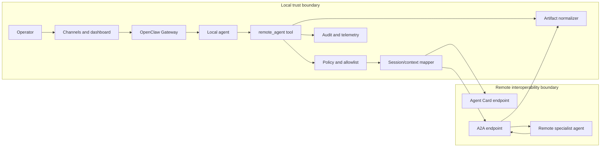
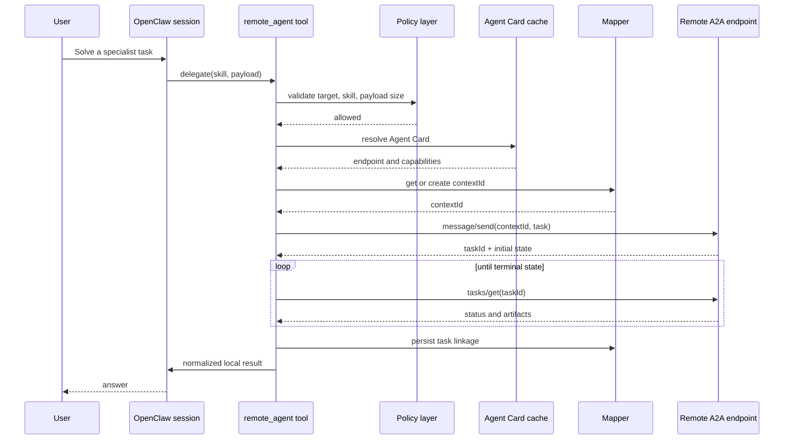
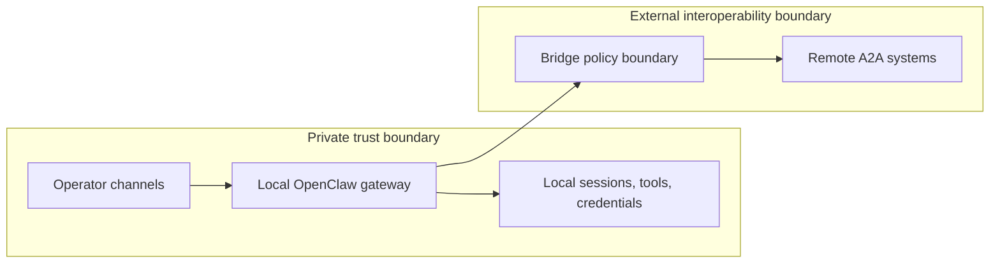

# Architecture: OpenClaw A2A Secure Runtime

**Status:** Draft reference architecture  
**Audience:** Staff+ engineers, platform engineers, security engineers, and collaborators evaluating OpenClaw-to-A2A interoperability  
**Primary thesis:** Keep OpenClaw as the local control plane. Use A2A as a constrained remote delegation layer.

---

## 1. Executive Summary

This document describes a conservative interoperability architecture between **OpenClaw** and **A2A-compatible remote agents**.

The central design decision is simple:

> **OpenClaw remains the local system of record for channels, sessions, operator trust, and tool execution. A2A is introduced only as a remote specialist execution layer.**

This design intentionally avoids the most dangerous first move: exposing a personal OpenClaw gateway as a public multi-tenant agent endpoint.

Instead, the first version is **outbound-only**:

- a local OpenClaw agent decides when remote delegation is appropriate
- a bridge tool performs remote discovery through an Agent Card
- the bridge sends work to a remote A2A endpoint
- the bridge tracks lifecycle state and normalizes artifacts back into a local OpenClaw reply

This is a better v1 architecture because it:

- preserves OpenClaw’s operator-centric trust boundary
- keeps the local gateway private
- makes delegation explicit and auditable
- gives a clean mapping from local session semantics to remote task semantics
- creates a path to richer interoperability later without requiring public exposure now

This document is **not** a full protocol spec and **not** a production readiness claim. It is a design reference meant to guide implementation, evaluation, and future hardening.

---

## 2. Background

OpenClaw is documented as a self-hosted gateway that connects chat apps and a dashboard to AI agents. Its plugin surface is broad: plugins and tools can register capabilities such as channels, model providers, tools, skills, and services. The current plugin docs also describe tool and hook plugins that can register agent tools, event hooks, or services. Session tools document primitives such as `sessions_send` and `sessions_spawn`, which are directly relevant to delegation patterns. The dashboard docs also state that the Control UI is an admin surface and should not be exposed publicly. These details strongly support using OpenClaw as a **local control plane** rather than turning it into a public internet-facing integration bus by default.

A2A addresses a different problem. The A2A docs define an interoperability model in which clients discover remote agents through **Agent Cards**, select **skills**, submit **tasks**, and consume resulting **artifacts**. That makes A2A a good fit for **remote specialist delegation**, especially when the local system needs strong continuity while still handing off bounded work to a remote agent system.

The design challenge is not “can OpenClaw call another system?”

The real challenge is:

> How do we introduce remote specialist agents without breaking local trust boundaries, session continuity, operator expectations, or deployment safety?

---

## 3. Problem Statement

A personal OpenClaw deployment and a remote A2A ecosystem optimize for different things.

OpenClaw optimizes for:

- one trusted operator boundary per gateway
- local session continuity
- channel integration
- local tools and local workspaces
- private operator workflows

A2A optimizes for:

- interoperable agent discovery
- capability declaration through Agent Cards and skills
- remote task execution
- artifact-based result exchange
- collaboration between independent systems

If these systems are combined naïvely, several problems appear immediately:

1. **Local sessions do not automatically map to remote contexts**  
   OpenClaw sessions are operator- and channel-centric. A2A conversations use `contextId`.

2. **Local delegated runs do not automatically map to remote tasks**  
   The local runtime needs a precise remote handle for lifecycle tracking.

3. **Remote outputs may be structurally valid but operationally unsafe**  
   Even a legitimate artifact may be too large, too raw, or too privileged to surface directly.

4. **Remote delegation can silently widen the trust boundary**  
   A personal assistant deployment can quickly become a public integration point if remote connectivity is not constrained.

5. **Failure handling becomes ambiguous**  
   It must be clear whether a failure belongs to the local tool layer, transport layer, remote task layer, or normalization layer.

So the design problem is not a transport problem alone. It is a **control-plane, safety, and lifecycle** problem.

---

## 4. Goals

### 4.1 Design Goals

This architecture aims to:

1. **Preserve OpenClaw as the local control plane**  
   Local channels, sessions, operator context, and tool choice remain anchored in OpenClaw.

2. **Introduce remote delegation safely**  
   Remote A2A agents are execution targets, not replacement control planes.

3. **Keep the first deployment model private**  
   The bridge operates outbound-only in v1.

4. **Maintain continuity across turns**  
   A stable local session should be able to reuse a stable remote `contextId`.

5. **Make remote work traceable**  
   Each local delegated action should correspond to a concrete remote `taskId`.

6. **Normalize remote outputs before surfacing them locally**  
   The bridge returns a local-safe reply instead of raw remote protocol output.

7. **Support incremental hardening and rollout**  
   The system should evolve toward richer interoperability only after the initial bridge model is proven.

### 4.2 Non-Goals

This document does **not** target:

- complete A2A protocol coverage
- public multi-tenant hosting in v1
- enterprise auth, billing, quota, or policy systems
- binary artifact handling in the first release
- full streaming or push-notification support in the first release
- guaranteed compatibility with every future OpenClaw plugin API release

---

## 5. High-Level Architecture

### 5.1 Architectural Thesis

- **OpenClaw owns the user-facing session**
- **A2A owns remote specialist task execution**
- **The bridge owns translation, policy, lifecycle, and normalization**

That division is deliberate. It reduces ambiguity about who owns what, which becomes critical once you add failures, retries, and auditability.

---

## 6. Component Model

### 6.1 OpenClaw Gateway

The gateway is the local runtime boundary. It owns:

- operator-facing channels
- dashboard interactions
- local session continuity
- local tool execution
- local trust assumptions

### 6.2 Local Agent

The local agent decides whether remote delegation is necessary.

It should not blindly delegate. Delegation should be a **bounded tool choice** made under local policy constraints.

### 6.3 `remote_agent` Tool

This is the bridge entry point from the local agent’s perspective.

Responsibilities:

- accept a structured local request
- choose a remote target or skill
- invoke bridge policy checks
- delegate remote work
- return a normalized result or a clearly surfaced error

### 6.4 Policy Layer

The policy layer is where the bridge enforces:

- remote endpoint allowlists
- supported skills
- artifact size and type restrictions
- redaction or payload scrubbing rules
- per-session delegation constraints

### 6.5 Session/Context Mapper

The mapper maintains stable relationships such as:

- `sessionKey -> contextId`
- `localRunId -> taskId`
- `remoteEndpoint -> discovered capabilities`

The mapper is essential because local continuity and remote lifecycle are not identical concepts.

### 6.6 Agent Card Cache

The bridge caches Agent Cards to reduce repeated discovery overhead and to stabilize capability resolution.

Caching rules should be conservative:

- respect HTTP caching guidance if present
- allow forced refresh when skill resolution fails
- treat authentication and endpoint changes as cache-invalidation triggers

### 6.7 Transport Client

The transport client handles A2A request/response behavior.

In the first release, that usually means:

- Agent Card fetch
- `message/send`
- `tasks/get`

### 6.8 Artifact Normalizer

The normalizer converts remote artifacts into a local-safe output contract.

In v1, the safest default is usually:

- text artifacts only
- bounded size
- explicit type checks
- no blind pass-through of remote metadata

### 6.9 Audit and Telemetry

The bridge must emit logs and metrics that make delegated work debuggable.

At minimum, record:

- local session key
- remote endpoint
- selected skill
- context ID
- task ID
- terminal outcome
- latency
- normalization result

---

## 7. Core Mapping Model

### 7.1 Local Concepts

- **sessionKey**: local conversation identity
- **local run**: one delegated or non-delegated unit of local work
- **tool invocation**: local structured request to the bridge

### 7.2 Remote Concepts

- **Agent Card**: remote metadata document
- **skill**: declared remote capability
- **contextId**: remote conversation scope
- **taskId**: remote unit of work
- **artifact**: remote output payload

### 7.3 Mapping Table

| Local concept | Remote concept | Why it maps this way |
| --- | --- | --- |
| `sessionKey` | `contextId` | both represent continuity across turns |
| local run | `taskId` | both identify a single delegated unit of work |
| tool result | artifact | both represent completed output |
| routing decision | skill selection | both determine the execution target |

### 7.4 Design Rule

**One local session should normally map to one remote `contextId` per remote specialist target.**

That design choice makes follow-up turns coherent without forcing every delegation to start from zero.

**Each delegated action should create a new `taskId` inside that remote context.**

That keeps each piece of remote work traceable while preserving continuity.

---

## 8. End-to-End Request Flow

### 8.1 Request Stages

1. **Local decision stage**  
   The local agent decides to use the `remote_agent` tool.

2. **Policy stage**  
   The bridge confirms the endpoint and skill are allowed.

3. **Discovery stage**  
   The bridge fetches or reuses the Agent Card.

4. **Context stage**  
   The bridge resolves the remote `contextId` for this local session.

5. **Delegation stage**  
   The bridge submits remote work.

6. **Lifecycle stage**  
   The bridge tracks the task until a terminal state.

7. **Normalization stage**  
   The bridge extracts and sanitizes the artifact.

8. **Return stage**  
   The normalized result becomes part of the local OpenClaw interaction.

---

## 9. Security Model

### 9.1 Security Principle

The local OpenClaw deployment is a **private trust boundary**. Remote A2A systems are a **separate interoperability boundary**.

These boundaries should not be collapsed by default.

### 9.2 Security Invariants

1. **The dashboard stays private**  
   The Control UI should not be made publicly reachable.

2. **Remote delegation is opt-in**  
   Local sessions should not silently delegate unless policy allows it.

3. **Remote outputs are untrusted until normalized**  
   Remote artifacts are data, not authoritative local actions.

4. **Secrets should not leak into delegated payloads**  
   Keep local secret-bearing context out of remote requests whenever possible.

5. **Endpoint selection should be constrained**  
   Use explicit allowlists for hosts and skills.

### 9.3 Initial Policy Defaults

Recommended v1 defaults:

- fixed remote host allowlist
- fixed skill allowlist
- text-only artifact acceptance
- artifact size caps
- no binary pass-through
- no public inbound A2A server mode
- explicit error surfaces rather than silent fallbacks

---

## 10. Failure Model

The bridge must classify failures clearly.

### 10.1 Failure Classes

1. **Discovery failure**  
   Agent Card unavailable, invalid, or missing expected capabilities.

2. **Policy failure**  
   Host, skill, or payload rejected before delegation.

3. **Transport failure**  
   Request timeout, connection reset, or protocol-level request failure.

4. **Remote task failure**  
   Remote task reaches `failed`, `rejected`, or `canceled`.

5. **Normalization failure**  
   Artifact exists but violates local type or size expectations.

6. **Mapping failure**  
   Context or task linkage is missing, stale, or inconsistent.

### 10.2 Failure Handling Principles

- Fail **loudly** rather than silently changing semantics
- Surface a clear local tool error when delegation fails
- Preserve enough metadata for debugging
- Avoid automatic retry loops without policy awareness

### 10.3 Safe User Experience Rule

If remote delegation fails, the user should see:

- that the local system attempted delegation
- that delegation failed at a specific stage
- whether retry is safe or not

What the user should **not** see is a vague local hallucination pretending the remote work succeeded.

---

## 11. Observability

### 11.1 Logging

Every delegated request should emit structured logs including:

- timestamp
- local session key
- local run ID
- remote host
- selected skill
- remote context ID
- remote task ID
- terminal state
- end-to-end latency

### 11.2 Metrics

Recommended initial metrics:

- Agent Card fetch latency
- remote task completion latency
- successful delegation rate
- policy rejection count
- normalization failure count
- per-skill delegation count

### 11.3 Auditability

The bridge should make it possible to answer:

- which local session delegated work
- where it delegated work
- which skill was used
- what terminal state the remote task reached
- what output was accepted or rejected locally

---

## 12. Deployment Model

### 12.1 v1 Deployment

The recommended first deployment is:

- local OpenClaw gateway
- private dashboard access only
- outbound bridge enabled for a small allowlisted set of remote endpoints
- one or two narrow specialist skills

### 12.2 Why This Is the Right First Step

This deployment:

- minimizes exposure
- keeps operational ownership local
- gives a small evaluation surface
- preserves rollback simplicity

### 12.3 What Not To Do in v1

Do not begin with:

- public inbound A2A exposure of the personal gateway
- unrestricted remote endpoint choice
- automatic delegation across all tasks
- binary artifact execution or blind tool pass-through

---

## 13. Alternatives Considered

### Alternative A: Expose OpenClaw directly as an A2A server first

**Rejected for v1**

Why:

- expands exposure too quickly
- complicates authentication and tenancy immediately
- conflicts with a personal-assistant-first deployment posture

### Alternative B: Treat remote agents as generic HTTP tools

**Rejected for v1**

Why:

- discards A2A-native concepts such as Agent Cards, tasks, and artifacts
- makes lifecycle semantics ad hoc
- weakens interoperability

### Alternative C: Let the remote agent system become the top-level control plane

**Rejected for v1**

Why:

- breaks the local operator model
- weakens OpenClaw’s value as the session anchor
- increases coordination complexity

---

## 14. Rollout Plan

### Phase 1: Proof of Concept

- mock A2A server
- Agent Card discovery
- task submission
- polling lifecycle
- text artifact normalization
- conceptual OpenClaw tool integration

### Phase 2: Hardened Local Bridge

- durable mapper state
- configurable host and skill allowlists
- explicit redaction policies
- richer remote error taxonomy
- structured telemetry

### Phase 3: Production Candidate

- stronger endpoint authentication design
- streaming support where justified
- structured artifact support
- policy-as-code integration
- improved evaluation and rollback procedures

### Phase 4: Advanced Interoperability

- optional hardened inbound A2A mode
- richer multi-specialist routing
- organizational trust segmentation
- tenant-aware policy boundaries where truly needed

---

## 15. Open Questions

1. How should durable mapping state be stored across gateway restarts?
2. Should skill routing be explicitly configured or partially learned?
3. What is the smallest safe artifact model beyond plain text?
4. Under what conditions, if any, should the bridge support streaming results?
5. What is the right boundary for inbound A2A in a future hardened deployment?

These are good follow-on questions precisely because the architecture keeps them isolated from the initial private-first bridge.

---

## 16. Decision Summary

The recommended starting architecture is:

- **OpenClaw as the local control plane**
- **A2A as a remote delegation protocol**
- **an outbound-only bridge as the integration layer**
- **policy, mapping, normalization, and auditability centered in the bridge**

This gives us a strong initial posture:

- clear trust boundaries
- explicit lifecycle semantics
- incremental rollout
- strong operator control
- a clean path to future extension

If the goal is to move from “interesting agent demo” to “production-oriented agent system design,” this is the right first architecture.

---

## 17. References

### OpenClaw

- https://docs.openclaw.ai/
- https://docs.openclaw.ai/tools/plugin
- https://docs.openclaw.ai/tools
- https://docs.openclaw.ai/plugins/building-plugins
- https://docs.openclaw.ai/plugins/sdk-overview
- https://docs.openclaw.ai/concepts/session-tool
- https://docs.openclaw.ai/web/dashboard
- https://docs.openclaw.ai/gateway/configuration

### A2A

- https://a2a-protocol.org/latest/
- https://a2a-protocol.org/latest/specification/
- https://a2a-protocol.org/latest/topics/agent-discovery/
- https://a2a-protocol.org/latest/topics/key-concepts/
- https://a2a-protocol.org/latest/topics/life-of-a-task/
- https://a2a-protocol.org/latest/tutorials/python/3-agent-skills-and-card/
